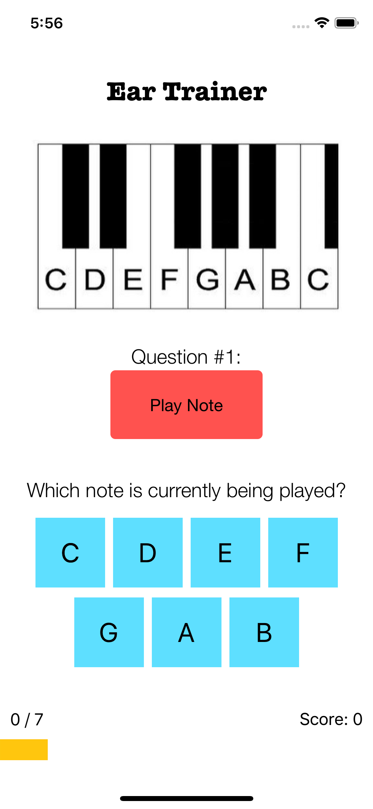
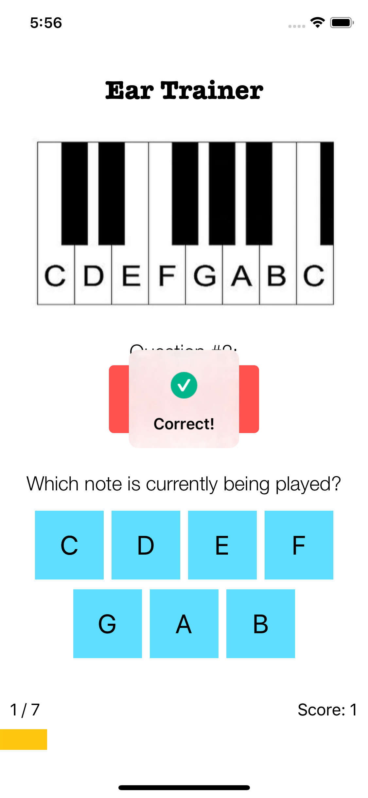
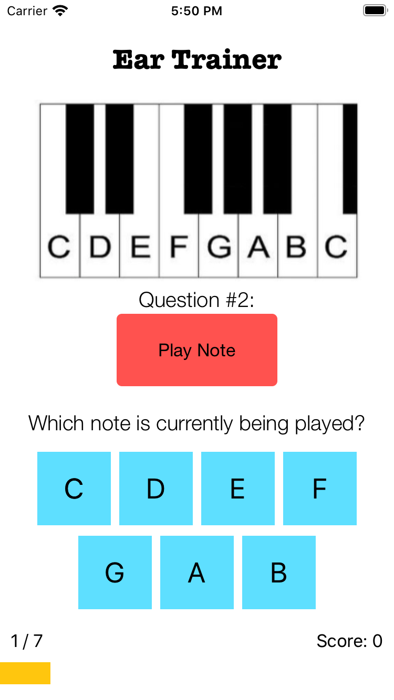
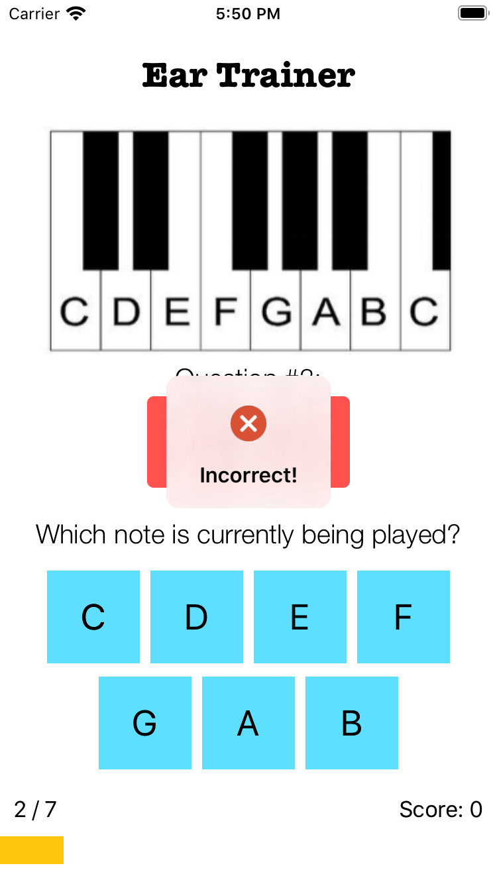

# Ear Trainer

Ear Trainer is an app that aims to help users improve pitch recognition and develop an ear for musical appreciation.
It follows a question-based format and quizzes users by playing a variety of random pitches and keeping score of
which ones they identify correctly.

## Overview

Ear Trainer is coded in Swift, uses AVFoundation as its audio framework,
and was designed to follow the Model-View-Controller architectural pattern.

## Images

Ear Trainer shown running on iPhone 11 Pro. ProgressHUD shows instant feedback for correct/incorrect answers.

And iPhone 8:

